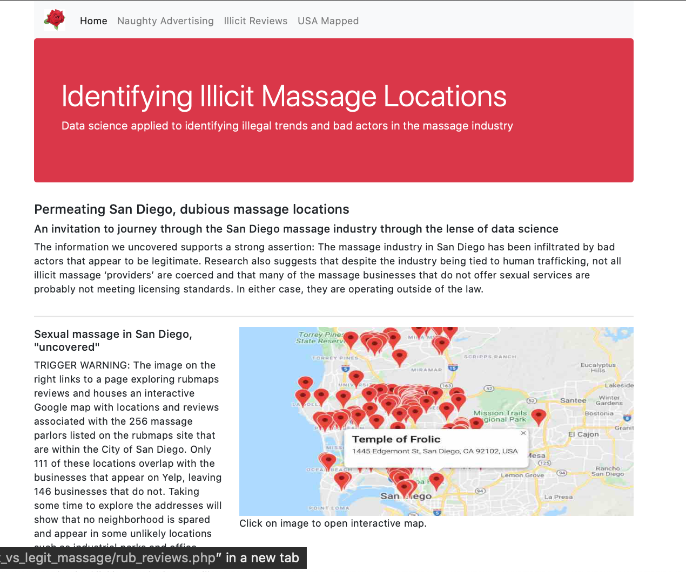
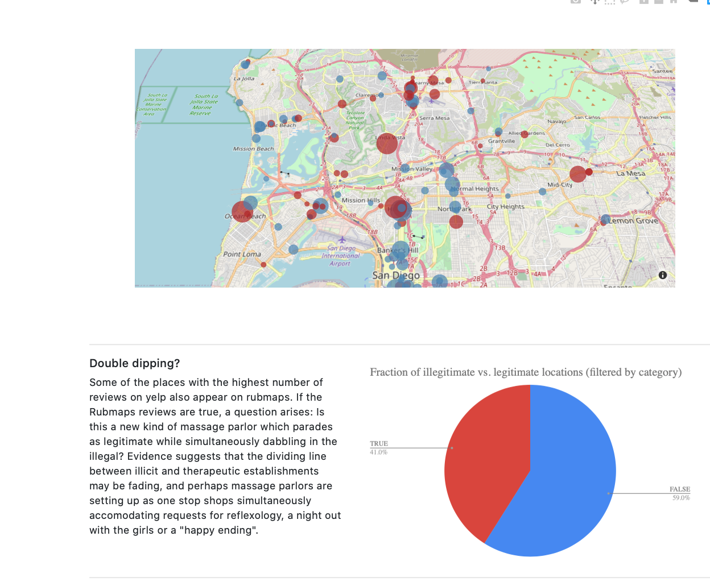
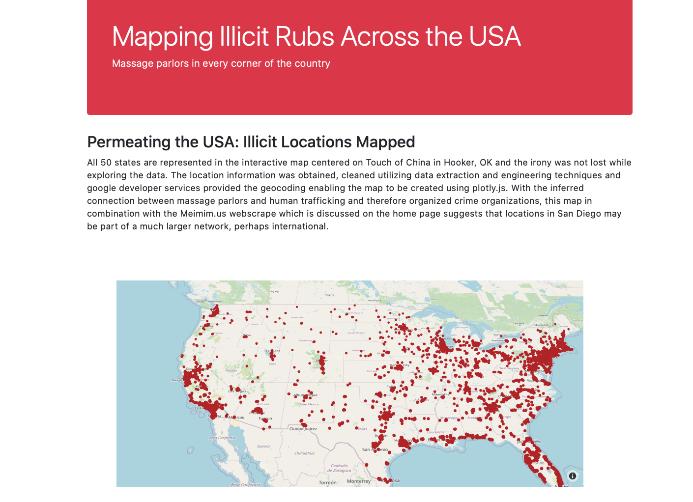

### Legal or Illicit

### About
This project explores the potential effects of weakened massage therapy regulation as the industry seems to be experiencing a decline of reputation in San Diego.

### <a href="https://sherirosalia.github.io/ufo_sightings/">Link</a>
### Frameworks
Back end database management and integration is based on PHP, Javascript and SQl. 
Bootstrap 4 provides the majority of front end HTMl
Google Maps, Plotly, Google Sheets and Chart.js fuel maps, charts and interactive displays.
Supporing data and files associated with scraping reside in other repositories. Although some data was available for download, much was obtaines using Python Scrapy and normalized with Python and Python Pandas library.

### Please note
This is a first draft, and a work in progress. The next steps will be to anonymize data results and organize folders. 

### Trigger warning
Some of the content is unintentionally explicit due to the nature of the nature of the advertising sites incorporated into the datasets.

### Landing Page

### Mapping Business Types

### Across the USA

