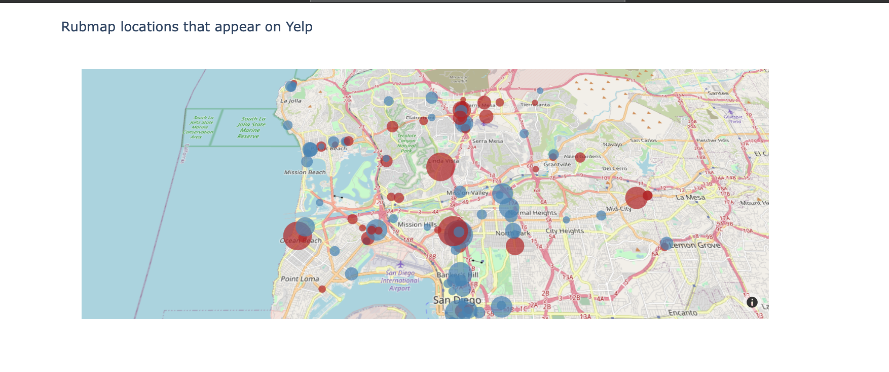
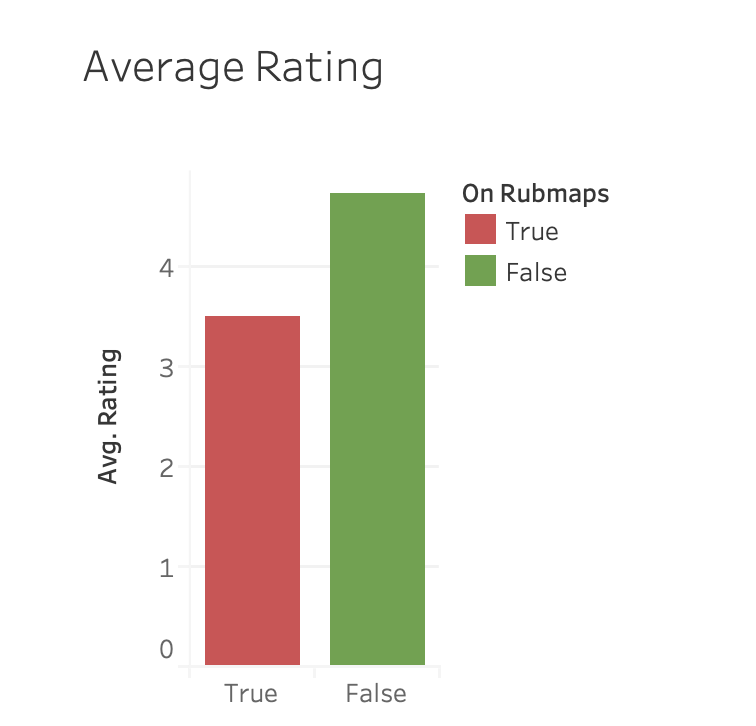
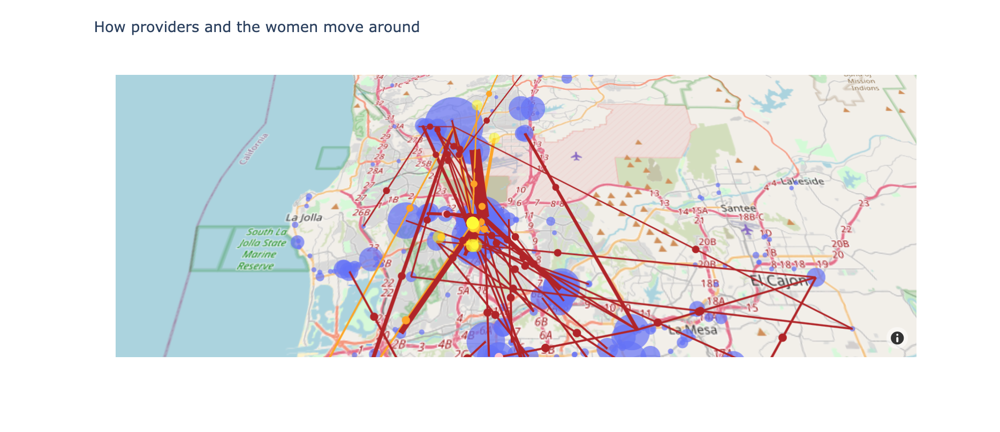

### Legal or Illicit

### About
Forensic data analysis of illicit vs. legitimate massage industry in San Diego, CA.
Webscraping, API and CSV production scripts are in the "merged_massage_data" repository.

### Frameworks
HTML, CSS and PLOTLY

### Contents
Supporting data is in "data" folder.
Maps are produced using Plotly and are in "html_inclusions" file.

### Website
### <a href="https://sherirosalia.github.io/Legal-or-Illicit-/">Legal or Illicit</a>

### Landing Page

### Mapping Business Types

### Provider movement between establishments
